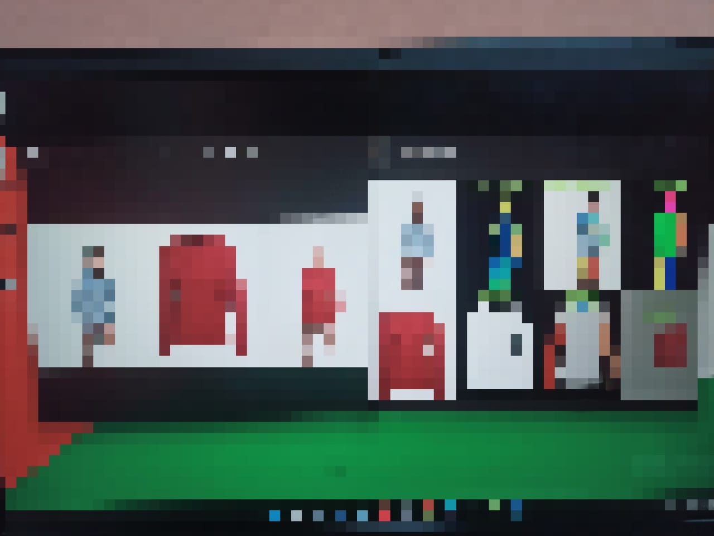

# **Project Name**
**LSD-VTON** for **L**ocal Flow Global Parsing integrated with **S**table **D**iffusion Virtual Try-on

## **Introduction**
The virtual tryon system is based on GP-VTON and LaDi-VTON

We exploit the GP-VTON power in warping(LFGP) and the LaDi-VTON power in generation(Stable diffusion)

Dataset: VITON-HD

**LSD-VTON System Architecture**
<div style="width: 100%; text-align: center;margin:auto">

</div>

**Used Technologies/Apps:**
- Python
- FastAPI
- Kaggle API
- SQL Server
- HTML, CSS, JS
- Kaggle (P100 GPU 16 GB VRAM, 16 GB RAM)
- Pycharm IDE

Developed and maintained By (Order Does not matter):

- [Mohamed Walid](https://github.com/MohamedWalidxX)
- [Karim Metwally](https://github.com/KarimMetwaly19)
- [Mohamed Mostafa](https://github.com/pmohmmed)
- [Mohamed Hesham](https://github.com/mohamedhesham840)
- [Omar Ehab](https://github.com/OmarEhab162)
- [Mohamed Ahmed](https://github.com/SEmohamedAhmed)


## **Demo video**
[Click Here for the demo](https://drive.google.com/file/d/1UZuarGgWUsnE3_fvW8du39U0Rbuy5FyX/view?usp=sharing)


## **Mody Test**
This section we will introduce our work (no code here) to test the
**GP-VTON**, **LaDi-VTON** and **LSD-VTON** architectures but using new person/cloth images (which not included in the original dataset) i.e we will try-on our personal image and our clothes

I called it **Mody Test**!

For **Mody Test** (custom input) we only have (our inputs)
- Person image
- Cloth image

and in **Mody Test**
we do a preprocessing task which includes complicated tasks which are: 
- Person parse (Human parse)
- Person keypoints (skelton)
- Person densepose
- Cloth parse
- Cloth binary mask

<strong>Here is a spoiler image for our work (Mody Test)</strong>

<div style="width: 100%; text-align: center;margin:auto">

</div>

## **Citation**

```bibtex
@inproceedings{xie2023gpvton,
  title     = {GP-VTON: Towards General Purpose Virtual Try-on via Collaborative Local-Flow Global-Parsing Learning},
  author    = {Zhenyu, Xie and Zaiyu, Huang and Xin, Dong and Fuwei, Zhao and Haoye, Dong and Xijin, Zhang and Feida, Zhu and Xiaodan, Liang},
  booktitle = {Proceedings of the IEEE/CVF Conference on Computer Vision and Pattern Recognition (CVPR)},
  month     = {June},
  year      = {2023},
}
```

```bibtex
@inproceedings{morelli2023ladi,
  title={{LaDI-VTON: Latent Diffusion Textual-Inversion Enhanced Virtual Try-On}},
  author={Morelli, Davide and Baldrati, Alberto and Cartella, Giuseppe and Cornia, Marcella and Bertini, Marco and Cucchiara, Rita},
  booktitle={Proceedings of the ACM International Conference on Multimedia},
  year={2023}
}
```

## **Acknowledgments**
Thanks for all authors of 
- [GP-VTON](https://github.com/xiezhy6/GP-VTON)
- [LaDi-VTON](https://github.com/miccunifi/ladi-vton/tree/master)


## **License**
The use of this code is RESTRICTED to non-commercial research and educational purposes.
